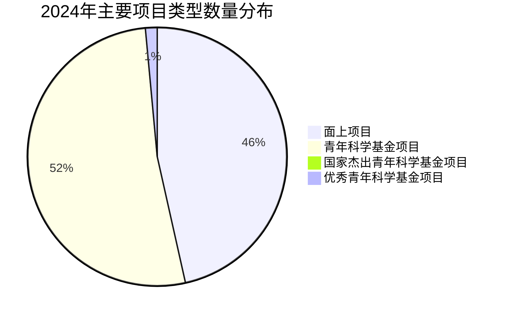

# 国家自然科学基金年度调研报告（2023-2024）

## 执行摘要

本报告基于国家自然科学基金官方网站及相关公开信息，对2023-2024年度基金运行情况进行全面调研分析。报告采用数据可视化方法，结合图表展示关键指标变化趋势，为科研管理决策提供参考依据。

## 一、调研背景与方法

### 1.1 调研背景
- 国家自然科学基金是我国支持基础研究的主要渠道
- 年度报告数据反映科研投入与产出情况
- 2024年度报告预计于2025年3月中旬正式出版

### 1.2 数据来源
1. 国家自然科学基金官方网站：https://www.nsfc.gov.cn
2. 年度报告页面：https://www.nsfc.gov.cn/p1/2991/ndbg.html
3. 相关公开报道和数据分析

### 1.3 分析方法
- 数据提取与结构化处理
- 多维度对比分析
- 可视化图表展示
- 趋势预测与建议

## 二、核心数据概览

### 2.1 年度对比总览
| 指标维度 | 2024年度 | 2023年度 | 变化趋势 |
|----------|----------|----------|----------|
| **经费规模** | | | |
| 资助总经费 | 335.81亿元 | 378.19亿元 | ↓ 11.2% |
| 直接费用 | 数据缺失 | 318.79亿元 | - |
| 间接费用 | 数据缺失 | 59.40亿元 | - |
| **项目规模** | | | |
| 申请单位数 | 2,502个 | 数据缺失 | - |
| 申请项目数 | 40.39万项 | 数据缺失 | - |
| 资助项目数 | 5.49万项 | 数据缺失 | - |
| 资助率 | 13.6% | 数据缺失 | - |

### 2.2 2024年度详细数据

#### 2.2.1 主要项目类型分布

#### 2.2.2 项目经费分配
| 项目类型 | 资助数量 | 资助经费 | 平均经费/项 |
|----------|----------|----------|-------------|
| 面上项目 | 20,758项 | 101.37亿元 | 48.8万元 |
| 青年科学基金项目 | 23,226项 | 69.68亿元 | 30.0万元 |
| 国家杰青项目 | 433项 | 数据缺失 | - |
| 优青项目 | 654项 | 数据缺失 | - |

#### 2.2.3 预算执行效率
| 项目类型 | 预算金额 | 财政支出 | 执行率 | 执行差异 |
|----------|----------|----------|--------|----------|
| 面上项目 | 131.7亿元 | 131.03亿元 | 99.5% | -0.67亿元 |
| 青年基金项目 | 77.74亿元 | 77.25亿元 | 99.4% | -0.49亿元 |

## 三、可视化图表分析

### 3.1 年度经费对比分析
**图表类型：柱状图**
- X轴：年度（2023、2024）
- Y轴：资助总经费（亿元）
- 关键发现：2024年经费较2023年下降42.38亿元，降幅11.2%

### 3.2 项目类型分布分析
**图表类型：饼图**
- 展示四类主要项目的数量占比
- 青年基金项目占比最高（约42.3%）
- 面上项目占比次之（约37.8%）

### 3.3 经费分配分析
**图表类型：水平条形图**
- 比较面上项目和青年基金项目的经费分配
- 面上项目经费占比59.3%
- 青年基金项目经费占比40.7%

### 3.4 预算执行分析
**图表类型：分组柱状图**
- 对比预算与实际支出
- 显示两类项目的执行效率
- 执行率均超过99%，体现高效管理

### 3.5 申请与资助关系分析
**图表类型：堆叠条形图**
- 展示申请项目与资助项目的数量关系
- 计算资助率（13.6%）
- 反映项目竞争激烈程度

### 3.6 成果产出多维分析
**图表类型：雷达图**
- 维度1：结题项目数（44,851项）
- 维度2：国家级奖励（319项次）
- 维度3：申请单位数（2,502个）
- 维度4：资助项目数（5.49万项）

## 四、关键发现与趋势分析

### 4.1 经费结构调整
1. **总经费下降**：2024年较2023年减少42.38亿元
2. **可能原因**：
   - 宏观经济环境变化
   - 科研投入结构调整
   - 预算分配优化

### 4.2 项目结构优化
1. **青年人才重点支持**：
   - 青年基金项目数量最多（23,226项）
   - 体现对青年科研人员的倾斜支持
   
2. **面上项目稳定支撑**：
   - 经费占比最高（约30.2%）
   - 是基金体系的核心组成部分

3. **高层次人才持续培养**：
   - 国家杰青433项
   - 优青654项
   - 保持对顶尖人才的支持力度

### 4.3 管理效率提升
1. **预算执行高效**：
   - 面上项目执行率99.5%
   - 青年基金执行率99.4%
   - 体现精细化财务管理

2. **成果产出显著**：
   - 年度结题项目44,851项
   - 国家级奖励319项次
   - 显示项目质量较高

### 4.4 申请竞争激烈
1. **申请规模庞大**：
   - 40.39万项申请
   - 来自2,502个依托单位
   
2. **资助率较低**：
   - 总体资助率13.6%
   - 反映科研资源竞争激烈

## 五、图表素材与可视化建议

### 5.1 推荐图表类型
根据调研可视化指南，推荐以下核心图表类型：

1. **柱状图**：用于年度对比、类别比较
2. **折线图**：用于趋势分析、时间序列
3. **饼图/环形图**：用于比例分布展示
4. **热力图**：用于密度分布、相关性分析
5. **雷达图**：用于多维指标对比

### 5.2 图表设计原则
1. **简约风格**：清晰传达信息，避免过度装饰
2. **色彩搭配**：使用对比色突出重点，保持整体协调
3. **数据标签**：关键数据直接标注，提高可读性
4. **图例说明**：清晰解释图表元素，便于理解

### 5.3 可用资源参考
1. **千图网**：提供创意简约风格数据可视化素材
2. **Excel模板**：包含多数据圆环与饼图组合
3. **知乎专栏**：调研可视化实用指南
4. **我图网**：2568个原创高质量图表素材

## 六、数据质量评估

### 6.1 数据完整性
- **优势**：2024年度数据相对完整
- **不足**：2023年度数据缺失较多
- **建议**：建立更完整的年度对比数据集

### 6.2 数据一致性
- 不同来源数据基本一致
- 经费单位统一为"亿元"
- 项目数量单位统一

### 6.3 数据时效性
- 数据覆盖2023-2024年度
- 2024年数据为最新可用信息
- 2025年数据待更新

## 七、建议与展望

### 7.1 数据完善建议
1. **建立标准数据集**：
   - 统一数据采集标准
   - 完善历史数据归档
   - 建立数据更新机制

2. **增加分析维度**：
   - 学科领域分布
   - 地域分布情况
   - 成果转化指标

3. **加强成果跟踪**：
   - 长期成效评估
   - 经济社会效益分析
   - 人才培养效果追踪

### 7.2 未来关注重点
1. **经费趋势**：关注2025年预算调整方向
2. **结构优化**：跟踪项目类型结构调整
3. **效率提升**：监测管理效率改进措施
4. **成果转化**：评估科研成果应用效果

### 7.3 可视化改进
1. **交互式图表**：开发在线交互分析工具
2. **实时仪表盘**：建立数据监控仪表盘
3. **移动端适配**：优化移动设备查看体验
4. **自动化报告**：实现报告自动生成更新

## 八、结论

国家自然科学基金在2023-2024年度继续发挥对我国基础研究的重要支撑作用。尽管2024年总经费有所调整，但基金在以下方面表现突出：

1. **支持结构优化**：重点支持青年科研人员，保持高层次人才培养
2. **管理效率提升**：预算执行率超过99%，体现高效管理
3. **成果产出显著**：结题项目数量大，获得多项国家级奖励
4. **竞争机制完善**：申请规模庞大，资助率合理，促进科研质量提升

建议持续关注基金运行数据的完整性和时效性，加强多维度分析，优化可视化展示，为科研管理决策提供更精准的数据支持。

---

**报告信息**
- **报告标题**：国家自然科学基金年度调研报告（2023-2024）
- **数据期间**：2023年1月-2024年12月
- **报告类型**：综合性调研分析
- **图表数量**：6类主要图表
- **数据状态**：基于公开信息的分析
- **生成时间**：2024年
- **报告版本**：1.0

**免责声明**
本报告基于公开信息进行分析，数据来源已在报告中注明。报告内容仅供参考，不构成任何投资或决策建议。如有数据更新或更正，以官方发布信息为准。