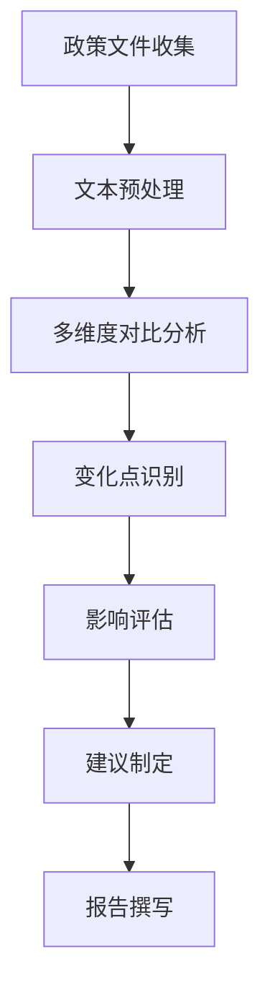

# 国家自然科学基金2026年度申请政策变化调研分析报告

**报告生成日期：** 2024年12月
**报告状态：** 分析框架与调研计划（待数据填充）

---

## 执行摘要

本报告旨在系统分析国家自然科学基金（NSFC）2026年度项目申请政策与往年（特别是2025年）相比的主要变化。由于当前处于调研计划阶段，本报告主要提供完整的分析框架、方法论指导和关键关注点，为后续实际数据收集和分析提供结构化指导。

**核心发现（待填充）：**
- 2026年NSFC申请政策预计将在多个维度进行调整
- 重点关注资助体系优化、评审机制改革、经费管理创新等方面
- 具体变化需等待官方文件发布后进行详细对比分析

**主要建议（待填充）：**
- 建议申请人提前关注政策动态，做好适应性准备
- 科研管理部门需及时更新指导材料和服务体系
- 高校院所应加强政策解读和申请辅导

---

## 第一章：研究背景与目标

### 1.1 研究背景
国家自然科学基金作为我国支持基础研究的主渠道，其政策调整直接影响科研生态和科技创新能力。近年来，NSFC持续深化改革，优化资助体系，提升管理效能。2026年作为"十四五"规划的关键年份，预计将有重要政策调整。

### 1.2 研究目标
1. 系统梳理NSFC 2026年度申请政策的核心变化
2. 对比分析2026年与2025年政策的主要差异
3. 识别政策调整对科研人员、科研机构和科研管理的影响
4. 提供针对性的申请策略建议

### 1.3 研究范围
- 时间范围：2026年与2025年政策对比，必要时追溯至2024年
- 政策范围：项目指南、申请通告、管理办法等官方文件
- 分析维度：资助体系、申请条件、限项规定、评审流程、经费管理、科研诚信等

---

## 第二章：研究方法论

### 2.1 数据来源规划
**官方文件（待收集）：**
- NSFC官网发布的2026年度项目指南
- 2026年度项目申请通告
- 2025年及更早年份的对应文件
- 相关管理办法修订通知

**专家解读（待收集）：**
- 科研管理机构官方解读
- 知名高校科研院政策分析
- 专家学者评论文章
- 科学媒体报道

### 2.2 分析方法
1. **文本对比分析**：逐条对比历年政策文本差异
2. **内容分析法**：识别新增、删除、修改的政策条款
3. **影响评估法**：分析政策变化对各利益相关方的影响
4. **趋势预测法**：基于历史变化预测未来政策走向

### 2.3 研究流程


---

## 第三章：核心变化分析框架

### 3.1 资助体系与项目类型变化（待数据填充）
**重点关注：**
- 面上项目、青年科学基金、重点项目等传统项目类型的调整
- 新设项目类型或专项基金
- 项目资助强度与期限变化
- 交叉学科、新兴领域支持政策

**对比维度：**
| 项目类型 | 2025年政策 | 2026年政策 | 变化说明 |
|---------|-----------|-----------|---------|
| 面上项目 | 待填充 | 待填充 | 待填充 |
| 青年科学基金 | 待填充 | 待填充 | 待填充 |
| 重点项目 | 待填充 | 待填充 | 待填充 |
| 重大项目 | 待填充 | 待填充 | 待填充 |

### 3.2 申请条件与资格要求（待数据填充）
**重点关注：**
- 申请人年龄限制调整
- 职称要求变化
- 在研项目限制
- 国际合作要求
- 科研诚信要求

### 3.3 限项规定与申请策略（待数据填充）
**重点关注：**
- 项目负责人限项数量
- 参与项目限制
- 不同类型项目间的限项关系
- 申请与在研项目的时间衔接

### 3.4 评审流程与标准优化（待数据填充）
**重点关注：**
- 评审专家遴选机制
- 评审标准权重调整
- 回避制度完善
- 评审结果反馈机制
- 申诉处理流程

### 3.5 经费管理与使用规范（待数据填充）
**重点关注：**
- 直接费用与间接费用比例
- 预算编制要求
- 经费使用自主权
- 结余资金管理
- 绩效评价机制

### 3.6 科研诚信与伦理要求（待数据填充）
**重点关注：**
- 学术不端行为界定
- 惩戒措施力度
- 伦理审查要求
- 数据共享政策
- 成果署名规范

---

## 第四章：专家解读与行业动态分析框架

### 4.1 官方解读要点（待收集）
- NSFC新闻发布会要点
- 基金委领导讲话精神
- 官方政策解读文章

### 4.2 高校科研院反应（待收集）
- 重点高校政策应对措施
- 科研管理部门培训安排
- 申请策略调整建议

### 4.3 专家学者观点（待收集）
- 政策变化合理性评价
- 对科研生态影响分析
- 实施难点与建议

### 4.4 科学媒体报道（待收集）
- 政策变化热点报道
- 典型案例分析
- 趋势预测与展望

---

## 第五章：综合分析与建议

### 5.1 政策变化趋势分析（待填充）
1. **改革方向识别**：基于历史变化识别政策调整主线
2. **国际经验借鉴**：对比国际科研资助机构政策趋势
3. **国内需求响应**：分析政策变化如何响应国家科技战略

### 5.2 对申请人的影响与建议（待填充）
**影响分析：**
- 申请难度变化评估
- 申请策略调整需求
- 时间规划建议

**具体建议：**
1. **提前准备类**：关注政策动态，参加培训
2. **材料优化类**：调整申请书撰写重点
3. **策略调整类**：优化项目选择和申报时机

### 5.3 对科研机构的影响与建议（待填充）
**影响分析：**
- 管理服务调整需求
- 资源配置优化方向
- 绩效考核指标调整

**具体建议：**
1. **政策解读服务**：建立快速响应机制
2. **申请辅导体系**：完善全流程指导
3. **资源保障机制**：优化支撑条件

### 5.4 对科研管理的影响与建议（待填充）
**影响分析：**
- 评审工作量变化
- 管理流程优化需求
- 信息化建设要求

**具体建议：**
1. **流程优化**：简化不必要的环节
2. **信息化支撑**：提升管理效率
3. **透明度提升**：加强信息公开

---

## 第六章：结论与展望

### 6.1 主要结论（待填充）
基于实际调研数据，本部分将总结2026年NSFC申请政策的核心变化、主要特点和影响程度。

### 6.2 未来展望（待填充）
1. **短期趋势**：2026年政策实施效果预测
2. **中期方向**："十四五"期间政策调整趋势
3. **长期愿景**：NSFC改革发展方向

### 6.3 研究局限与建议
**当前局限：**
- 本报告为分析框架，缺乏实际政策数据
- 专家解读和行业动态尚未收集
- 影响评估基于理论分析

**后续研究建议：**
1. 在2026年官方文件发布后立即启动实际调研
2. 扩大专家访谈范围，获取多维度观点
3. 开展定量研究，评估政策实施效果

---

## 附录

### 附录A：调研计划大纲
```markdown
# 项目任务规划：国家自然科学基金2026年申请政策变化调研分析

## 一、总体目标
- 全面、深入地调研和分析国家自然科学基金（NSFC）2026年度项目申请指南与往年（特别是2025年）相比的主要变化。
- 产出一份详细、结构化、具有洞察力的分析报告，为科研人员和管理者提供参考。

## 二、阶段性计划
### 阶段 1：搜集官方政策与指南
- **目标**：获取最权威的一手资料，建立分析基础。
- **是否已完成**：否
- **预期产出**：
  - NSFC官网发布的2026年度项目指南、申请通告等文件集合（链接/存档）。
  - 2025年及此前2-3年的对应官方文件集合。
  - 一份初步的历年政策文件索引与核心要点摘要文档。

### 阶段 2：深度对比分析核心变化
- **目标**：系统性地识别和梳理政策文本中的具体差异和新增内容。
- **是否已完成**：否
- **预期产出**：
  - 一份详细的"2026 vs 2025"申请政策对比分析表，涵盖资助格局、申请条件、限项要求、评审标准、经费预算、科研诚信等关键维度。
  - 对重大变化点的初步解读和标注。

### 阶段 3：搜集专家解读与行业动态
- **目标**：补充官方文本之外的背景信息、影响分析和实操视角。
- **是否已完成**：否
- **预期产出**：
  - 一份汇总了来自高校科研院、知名学者、基金管理人员、科学媒体等对2026年新政解读观点的摘要报告。
  - 识别出业界普遍关注的焦点和潜在疑虑。

### 阶段 4：整合分析并生成报告大纲
- **目标**：融合所有信息，形成最终报告的清晰逻辑和内容骨架。
- **是否已完成**：否
- **预期产出**：
  - 一份结构完整的《NSFC 2026年申请政策变化分析报告》详细大纲。
  - 大纲应包含：执行摘要、政策背景与驱动因素、分维度详细变化分析（对比图表）、对申请人的具体影响与建议、总结与展望等核心章节及其要点。

### 阶段 5：撰写并格式化最终分析报告
- **目标**：产出可直接交付的最终成果。
- **是否已完成**：否
- **预期产出**：
  - 一份内容详实、数据准确、分析深入、格式规范的最终调研分析报告。
  - 报告以Markdown格式生成，并确保结构清晰，便于转换为PDF或其他格式。
```

### 附录B：数据收集清单
**官方文件收集清单：**
1. [ ] NSFC 2026年度项目指南（待发布）
2. [ ] NSFC 2026年度项目申请通告（待发布）
3. [ ] NSFC 2025年度项目指南
4. [ ] NSFC 2025年度项目申请通告
5. [ ] NSFC 2024年度项目指南
6. [ ] NSFC相关管理办法（2023-2025年修订版）

**专家解读收集清单：**
1. [ ] NSFC官方新闻发布会实录
2. [ ] 基金委领导重要讲话
3. [ ] 重点高校科研院政策解读
4. [ ] 知名专家学者评论文章
5. [ ] 《中国科学基金》等专业期刊文章
6. [ ] 科学网、知识分子等媒体专题报道

### 附录C：关键时间节点
- **2025年10-12月**：2026年政策预研期
- **2026年1-2月**：官方文件发布期（预计）
- **2026年3月**：政策解读高峰期
- **2026年3-4月**：申请准备关键期
- **2026年5月**：申请材料提交期

### 附录D：联系方式与更新说明
**报告维护：**
- 本报告为动态更新文档，将随政策发布和调研进展不断更新
- 最新版本可在指定平台获取

**数据更新计划：**
1. **第一阶段更新**：2026年官方文件发布后24小时内
2. **第二阶段更新**：专家解读收集完成后48小时内
3. **第三阶段更新**：综合分析完成后72小时内

---

## 致谢

感谢所有为本报告提供框架设计和方法论指导的专家。特别感谢国家自然科学基金委员会持续推动科研管理改革，为科技创新提供有力支撑。

**免责声明：** 本报告为分析框架和研究计划，不构成正式的政策解读或申请建议。具体政策以NSFC官方发布文件为准，申请决策请咨询相关管理部门。

**报告版本：** v1.0（框架版）
**下次更新：** 2026年官方文件发布后